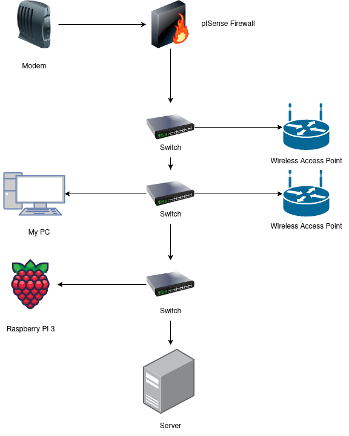

# Home Server
Bare metal Ubuntu Server. Mainly to self-host services such as media players (eg. jellyfin) and so on. Just started and plan on adding many more services and add vlans to network.

### Services
Currently running:
- Jellyfin (streaming movies, music, etc)
- Wireguard (VPN)
- Portainer (GUI to manage and view containers)
- Calibre (e-book service)

Plan to add:
- NextCloud (file hosting)
- GitLab (self-hosted github)
- Traefik (reverse proxy)  

and many more

## Hardware Components:
### Server Build
| Type | Item |
| --- | --- |
| CPU | Intel Core I3-10100 |
| Mobo | Gigabyte Aorus B560I |
| RAM | Corsair LPX 16GB |
| PSU | FSP Flex ATX 500W |
| Fan | Arctic P12 |
| SSD | Sabrent Rocket Q M.2 1 TB |
| HDD | Toshiba MG08-D 6 TB (x3) WD Red 6 TB |
| Case | ITX 4 Hot-Swap NAS Case |

### Hardware Firewall
| Type | Item |
| --- | --- |
| CPU + Mobo | Intel J4125 |
| RAM | Teamgroup Elite DDR4 8GB 2666 CL19 |
| mSata SSD | Dogfish mSata 120GB |
| Other Features | 4x 2.5G Lan Ports AES-NI Support 10W TDP |

### Basic network diagram

